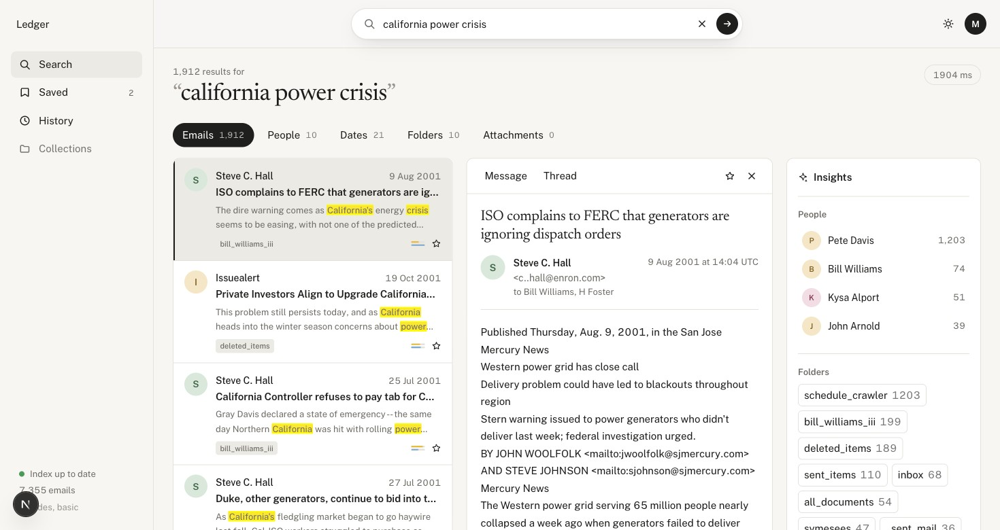
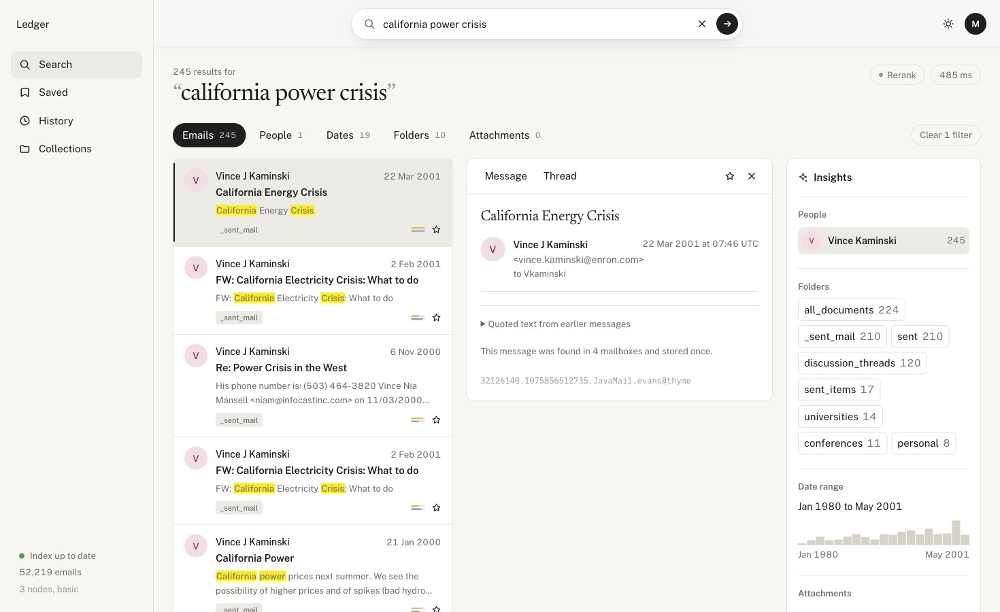

# Ledger — Email Investigation Search Engine

A production-grade email investigation and eDiscovery search engine built on
**Elasticsearch 9.5.3**, using the public **Enron** corpus (~500k emails, ~52k
after deduplication). One search box — free text, `"quoted phrases"`, field
operators (`from:`, `to:`, `cc:`, `subject:`, `before:`, `after:`), typo
tolerance, and semantic matching — the system decides how to query; the user
never picks "fuzzy" vs "prefix".


---

## Table of Contents

- [What We Built](#what-we-built)
- [Architecture](#architecture)
- [Tech Stack](#tech-stack)
- [Search Pipeline](#search-pipeline)
- [Ingestion Pipeline](#ingestion-pipeline)
- [Frontend](#frontend)
- [Relevance Evaluation](#relevance-evaluation)
- [Operations & HA](#operations--ha)
- [Quickstart](#quickstart)
- [Configuration](#configuration)
- [Repository Layout](#repository-layout)
- [Make Targets](#make-targets)
- [CI/CD](#cicd)
- [Key Design Decisions](#key-design-decisions)
- [Known Limitations](#known-limitations-stated-plainly)

---

## What We Built

Ledger is a **complete, end-to-end search product** — not a prototype or demo.
It covers the full lifecycle from raw data ingestion through hybrid retrieval to
a polished investigation UI:

| Layer | What it does |
|---|---|
| **Ingestion** | 7-stage resumable pipeline: download → parse → normalise → dedupe → thread → embed → index |
| **Search API** | FastAPI service with query understanding, hybrid BM25 + kNN retrieval, manual RRF fusion, optional cross-encoder reranking, faceted aggregations, autocomplete |
| **Frontend** | Next.js 15 editorial UI with syntax-highlighted search bar, facet filtering, reading pane, thread reconstruction, latency diagnostics |
| **Evaluation** | 68-query relevance harness with a tune/test split, auto-grading rules, NDCG@10/MRR/Recall metrics, CI regression gating |
| **Operations** | Latency benchmarking, chaos testing (kill-under-load HA), snapshot & restore |

> **Status**: complete. The shipped index holds **52,219 unique emails** from
> 100,000 parsed messages. All gates are met and their evidence is committed in
> [`ops/results/`](ops/results/PHASE6.md): p95 **189–208 ms** against a 300 ms
> target, a chaos run with **0 failed requests out of 2,802** while a node was
> killed mid-load, and snapshot/restore into a new index version with the live
> alias untouched.
>
> Two things are deliberately *not* claimed: this is 100k of 517,401 messages,
> and the 30 conceptual evaluation queries carry LLM labels, not human ones
> (reviewable with `make eval-label`). Both are explained under
> [Known limitations](#known-limitations-stated-plainly).

---

## Architecture

```
┌──────────────────┐     ┌──────────────────┐     ┌─────────────────────────────┐
│                  │     │                  │     │  Elasticsearch 9.5.3        │
│   Next.js 15     │────▶│   FastAPI API     │────▶│  3-node TLS cluster         │
│   (React 19)     │     │                  │     │                             │
│   Port 3000      │     │   Port 8000      │     │  es01:9200  es02:9201       │
│                  │     │                  │     │  es03:9202                  │
└──────────────────┘     └──────────────────┘     └─────────────────────────────┘
        │                        │                           ▲
        │                        │                           │
   /api/proxy/*             Query Parse                      │
   (server-side             BM25 + kNN                       │
    proxy, no               RRF Fusion              ┌───────────────┐
    creds in               Cross-Encoder             │  Ingest CLI   │
    client)                 Rerank                   │  (7 stages)   │
                                                     └───────────────┘
```

### Data Flow

```
Enron Tarball (1.4 GB)
    │
    ▼
┌─ Download ─── Parse ─── Normalise ─── Dedupe ─── Thread ─── Embed ─── Index ─┐
│  HTTP range    RFC-822   addr clean    SHA-1       Union-Find  BGE 384-d  bulk │
│  resumable     headers   whitespace   content-    + subject   cosine     load │
│  SHA-256       quoted    recipient    addressed   fallback    200-tok    alias │
│  verify        split     dedup        merge       30-day      chunks     flip  │
└───────────────────────────────────────────────────────────────────────────────┘
    │
    ▼
Versioned Index (emails-v2) ──▶ Alias (emails) ──▶ Search API
```

---

## Tech Stack

| Component | Technology |
|---|---|
| **Search engine** | Elasticsearch 9.5.3, Basic license, 3 shards × 1 replica |
| **API** | FastAPI 0.141, async `elasticsearch[async]` 9.5.1, Pydantic 2.13 |
| **Embeddings** | `BAAI/bge-small-en-v1.5` (384-d, cosine) via sentence-transformers |
| **Reranker** | `cross-encoder/ms-marco-MiniLM-L-6-v2` (optional, off by default) |
| **Frontend** | Next.js 15.5 (App Router), React 19, Tailwind CSS v4, Motion 12 |
| **Ingestion** | Python CLI with Typer, 7 idempotent stages |
| **Language** | Python 3.12 (uv workspace), TypeScript 5.9 |
| **Infrastructure** | Docker Compose (3-node + single-node + Kibana profiles), TLS |
| **CI/CD** | GitHub Actions — lint, typecheck, unit tests, integration tests, relevance gate |
| **Quality** | Ruff, Mypy (strict), Pytest, pre-commit |

---

## Search Pipeline

The search API (`GET /search?q=...`) processes every query through a multi-stage
pipeline. The user types naturally — the system figures out the rest.

### Query Understanding

```
raptor partnership from:kenneth.lay@enron.com after:2001-07-01 "hiding losses"
```

The parser extracts:
- **Free text**: `raptor partnership` → BM25 multi_match with `AUTO:5,8` fuzziness
- **Field operators**: `from:kenneth.lay@enron.com` → keyword term filter
- **Date ranges**: `after:2001-07-01` → range filter
- **Quoted phrases**: `"hiding losses"` → exact match on `.exact` subfields

No `query_string` or `regexp` — user input never has query-injection power.

### Hybrid Retrieval

```
                 ┌──────────────────┐
                 │  Parsed Query    │
                 └────────┬─────────┘
            ┌─────────────┴──────────────┐
            ▼                            ▼
    ┌──────────────┐           ┌───────────────┐
    │   BM25 Leg   │           │  kNN Leg      │
    │              │           │               │
    │ multi_match  │           │ nested chunks │
    │ + fuzziness  │           │ BGE embedding │
    │ + exact      │           │ k=200 cands   │
    │   phrases    │           │ + inner_hits  │
    │ + filters    │           │ + filters     │
    └──────┬───────┘           └───────┬───────┘
           │                           │
           └─────────┬─────────────────┘
                     ▼
           ┌──────────────────┐
           │  Manual RRF      │
           │  k = 60          │
           │  score(d) = Σ    │
           │  1/(k + rank)    │
           └────────┬─────────┘
                    ▼
           ┌──────────────────┐
           │  Cross-Encoder   │
           │  Rerank (opt.)   │
           │  top-50 window   │
           └────────┬─────────┘
                    ▼
              Search Response
        (hits, facets, timings)
```

- **Manual RRF** instead of Elasticsearch's native `rrf` retriever (requires a paid license)
- **Identical filters** applied to both BM25 and kNN legs — facet clicks never bypass vector search
- **Retrieval attribution**: every hit carries `matched_by: ["bm25", "knn"]` with per-leg ranks
- **Cross-encoder reranking** is off by default and auto-skipped for queries with phrases/operators
- **ML off the event loop**: embedding and reranking run in `asyncio.to_thread` so PyTorch doesn't block FastAPI

### API Endpoints

| Endpoint | Purpose |
|---|---|
| `GET /search?q=&size=&page_token=&rerank=` | Hybrid search with facets, timings, query explanation |
| `GET /emails/{id}` | Full email document |
| `GET /threads/{thread_id}` | Complete conversation thread, chronological |
| `GET /suggest?prefix=` | Autocomplete over senders and subjects |
| `PUT /emails/{id}/tags` | Replace an email's review tags (`relevant`, `privileged`, `hot`, ...) |
| `POST /tags/batch` | Add / remove tags on up to 500 emails |
| `GET /tags` | Tags in use, with counts |
| `GET /export?q=&tag=...` | The result set as CSV: every match for a filter-only query, the ranked list for a text query (D37) |
| `GET /health` | API + cluster health, license, node count, doc count |

Every response includes a per-stage `timings` breakdown (`parse_ms`, `embed_ms`,
`bm25_ms`, `knn_ms`, `fuse_ms`, `rerank_ms`, `total_ms`) and an `understood`
object explaining how the query was interpreted.

### Pagination

Opaque base64 page tokens with deterministic shard routing via SHA-1 `preference`
strings and tiebreaker sorting on `message_id`, so repeated requests read the
same shard copies in the same order.

Crucially, **the fusion window is a constant for a query, never a function of the
page**. RRF scores a document against whatever it was fused with, so a window
that grew per page re-ranked the whole list and page two repeated results from
page one. Pagination reaches `fusion_window` (120) results — six pages of 20 —
and the API says so in `warnings` rather than silently truncating.

Because the window is wide but a page is small, **highlighting is a separate,
id-filtered query over just the returned page**. Highlighting costs per document
(8.6 ms for 200 documents without it, 158.8 ms with), so keeping it off the
retrieval leg is what holds the latency target while pagination stays correct.
See DECISIONS D32.

---

## Ingestion Pipeline

A 7-stage, fully resumable, idempotent pipeline. Every stage reads JSONL in,
writes JSONL out (via atomic `.part` file replacement), and records structured
stats to `data/stats/<stage>.json`.

| Stage | Key Mechanics |
|---|---|
| **1. Download** | Streams Enron tarball with HTTP `Range` resume; SHA-256 verification; deterministic dev subset via SHA-1 mailbox ordering |
| **2. Parse** | RFC-822 `BytesParser`; Lotus Notes DN recovery; quoted-text splitting; UTC date normalisation |
| **3. Normalise** | Address lowercasing; recipient deduplication; whitespace collapsing; `person_id` assignment |
| **4. Dedupe** | Content-addressed SHA-1 over `(from, recipients, date, subject, body)`; cross-mailbox merge |
| **5. Thread** | Union-Find with path compression; RFC-822 `In-Reply-To`/`References` linkage; subject fallback that only attaches a `Re:`/`Fw:` message to the one it answers, within 30 days (D36) |
| **6. Embed** | `bge-small-en-v1.5` 384-d vectors; 200-token sliding window chunks (40-token overlap, max 8/doc); batched encoding; append-mode resume |
| **7. Index** | Bulk load with disabled refresh; pre-cutover verification (count + vectors); atomic zero-downtime alias flip |

```bash
make ingest-dev     # 10k-message dev subset → ~7,355 unique emails
make ingest-full    # full ~500k corpus
make stats          # per-stage processed / skipped / failed counts
make spotcheck      # compare 20 parsed docs against raw maildir files
```

The 100k subset (configured via `DEV_SUBSET_SIZE=100000`) ingests 100k parsed
messages into ~52,219 unique documents after deduplication (47.8% duplicate rate
across 31 mailboxes), producing a 307 MB primary index (615 MB with replicas).

Stages can run individually: `uv run python -m ingest.cli parse --subset dev`.

---

## Frontend

A Next.js 15 + React 19 + Tailwind v4 investigation interface with an archival
editorial aesthetic — warm parchment tones, editorial serif typography, lamp-lit
dark mode.


### Key UI Features

- **Travelling Search Pill**: Animates smoothly from the hero landing to the docked workspace header via `layoutId` — no destroy/remount
- **Syntax-Highlighted Input**: Dual-layer mirror renders colored token chips (`from:`, `"phrases"`, dates) in real-time as you type
- **Dual-Ink Highlighting**: Yellow markers for BM25 keyword hits, blue tinted passages for vector semantic matches
- **Signal Bars**: Stacked mini gauges showing each result's BM25 vs vector retrieval rank
- **Facet Filtering**: Interactive sidebar with top senders, folders, topics, attachment counts — click to filter
- **Timeline Histogram**: Month-by-month hit distribution with click-and-drag date range selection
- **Reading Pane**: Full message view with metadata, formatted body, collapsible quoted text, thread timeline
- **Thread Reconstruction**: Vertical timeline spine showing the complete conversation chain



- **Latency Diagnostics**: Badge showing total response time; click for per-stage breakdown popover
- **Cluster Health Badge**: Real-time status (green/yellow/red), node count, doc count
- **Dark Mode**: Lamp-lit desk aesthetic (not inverted), zero-flash via head script
- **Mock Mode**: `NEXT_PUBLIC_USE_MOCK=true` runs the full UI standalone with simulated BM25/kNN/RRF
- **Keyboard Shortcuts**: `⌘K` / `Ctrl+K` focuses search from anywhere
- **Server Proxy**: `/api/proxy/[...path]` routes to FastAPI — no backend URLs or auth in client bundles



---

## Relevance Evaluation

A rigorous evaluation framework that measures retrieval quality and gates CI
against regressions.

### Query Set

68 queries across 5 categories, alternately split into `tune` and `test` within
each category. Settings are chosen on `tune`; `test` is the number to believe.

| Category | Count | Examples |
|---|---|---|
| Exact lookup | 10 | `"rolling blackouts"`, `"force majeure"` |
| Person + topic | 12 | `from:john.arnold@enron.com gas` |
| Date-scoped | 8 | `from:john.arnold@enron.com after:2001-06-01 before:2001-09-30` |
| Conceptual | 30 | `concerns about hiding financial losses` |
| Typo | 8 | `califronia energy crisis`, `megawat hours` |

### Judgment System

- **Graded scale**: 0 (irrelevant) to 3 (exact answer)
- **38 queries auto-graded** with deterministic rules (required phrases, sender match, date window)
- **30 conceptual queries** carry **LLM labels** (1,031 judgments on the `eval/prelabel.py` rubric, source `"llm"`), not human ones. A human label always replaces an LLM one, and `make eval-label` offers each LLM label for review with its grade as the default.
- Unjudged queries **excluded** from means, never scored as zero

### Metrics

- **NDCG@10** — normalized discounted cumulative gain
- **MRR** — mean reciprocal rank of first relevant hit
- **Recall@50** — proportion of known relevant docs in top 50

### Results (`emails-v3`, 52,219 documents, 68 judged queries)

| Method | NDCG@10 | tune | test | MRR |
|---|---|---|---|---|
| BM25 | 0.6802 | 0.6847 | 0.6756 | 0.8281 |
| Vector | 0.6326 | 0.6731 | 0.5921 | 0.8630 |
| **Hybrid** | **0.7613** | **0.7490** | **0.7735** | **0.9430** |
| Hybrid + Rerank | 0.7936 | 0.8162 | 0.7711 | 0.9208 |

Hybrid beats BM25 in every category but typo and date-scoped, where the gap is ≤0.012. On the
conceptual queries, where semantic retrieval earns its keep, it scores 0.515 against BM25's 0.363.
Absolute conceptual NDCG is low by construction, because the judgment pools are deep. These
numbers come after the fixes in DECISIONS D35 (phrase filter on the vector leg, spelling
correction for the embedder, `minimum_should_match`). Before them, the same queries scored
hybrid 0.735. `Recall@50` is comparative only, because the judgment pool is built from these
same systems' own results.

Reranking is **off by default**: it helps overall and on `tune`, but is slightly
worse on `test` (DECISIONS D25, D35). It is implemented, flagged per request (`?rerank=true`),
and reports its own `rerank_ms` so its cost can never hide inside the total.

### Commands

```bash
make eval-pool      # pool candidates across all 4 methods, auto-grade
make eval-label     # interactive hand-labeling (resumable; --prelabel for LLM hints)
make eval           # compute metrics → eval/results/<date>.md
make eval-baseline  # update committed baseline
make eval-check     # CI gate: fail if hybrid NDCG@10 regressed >2 points
```

---

## Operations & HA

### Latency Benchmarking

```bash
make bench          # fires 50 queries at configurable concurrency (1, 4, 8)
```

Reports client wall-time percentiles (p50/p95/p99) alongside API per-stage
timings. At concurrency 4 on 52,219 documents, across three runs of 300
requests: **p95 = 189–208 ms** against a 300 ms target, with p99 under 300 ms
in every run. Latency tracks concurrency
far more than corpus size: the same measurement on a 7,355-document index gave
p95 154.7 ms (DECISIONS F16).

### Chaos Testing

```bash
make chaos          # kill-under-load HA test
```

1. Sustains search load for 20s under a healthy green cluster
2. `docker kill`s the node holding the most primary shards (not just any replica)
3. Continues load for 40s during yellow state and replica promotion
4. Restarts the killed node; waits for green recovery

Result: **100% request success rate** (0 failures across 2,802 requests) —
the FastAPI client round-robins across all 3 nodes and retries on connection loss.

### Snapshot & Restore

```bash
make snapshot               # snapshot the active index
make snapshots              # list repository
make restore SNAP=<name>    # restore into a NEW index version (never overwrites live)
```

---

## Quickstart

### Prerequisites

- **Docker Desktop** (or Docker Engine with Compose v2)
- **Python 3.12** (managed via [uv](https://docs.astral.sh/uv/))
- **Node.js 18+** and npm (for the frontend)
- ~8 GB free disk space

### 1. Clone & Install

```bash
git clone https://github.com/Mihir1107/elastic-search.git
cd elastic-search

# Python backend
make install            # creates .venv, installs api + ingest + dev tools

# Frontend
make web-install        # npm ci in web/
```

### 2. Configure

```bash
cp .env.example .env
# Edit .env — change ELASTIC_PASSWORD and KIBANA_PASSWORD

cp web/.env.local.example web/.env.local
```

**Do not skip the second line.** `NEXT_PUBLIC_USE_MOCK` defaults to *true* when
unset, so a frontend started without `web/.env.local` runs against an in-browser
fixture corpus and never calls your cluster. The health pill looks identical
either way — tell them apart by the results, not the pill.

`.env` also carries `ES_HOST`, which is **comma-separated** and lists all three
published nodes:

```
ES_HOST=https://localhost:9200,https://localhost:9201,https://localhost:9202
```

The client round-robins across them and retries elsewhere when one dies. With a
single host listed, killing that node fails every request and the chaos demo
cannot pass.

### 3. Start Elasticsearch

```bash
# 3-node HA cluster (recommended)
make up                 # starts setup + es01/es02/es03, waits for green, exports CA cert

# OR single node (lighter on laptop)
make up-single

# Optional: Kibana UI
make up-kibana          # http://localhost:5601 (user: elastic)
```

### 4. Verify

```bash
make health             # cluster health + license tier
```

### 5. Ingest Data

```bash
make ingest-dev         # 10k-message dev subset (~7,355 unique after dedup)
```

The subset size is a setting, so the shipped 100k corpus is the same command
with a bigger target (31 whole mailboxes, a deterministic superset of the dev
subset — roughly 50 minutes, mostly embedding):

```bash
DEV_SUBSET_SIZE=100000 INDEX_VERSION=v2 make ingest-dev
```

Or the whole archive, which is **5–7 hours** and needs the dedupe stage
rewritten to spill to disk first (DECISIONS D12, D27):

```bash
make ingest-full        # full Enron corpus (517,401 messages)
```

The first run downloads a 423 MB tarball from CMU and extracts only the
mailboxes it needs. Every stage is resumable: re-running picks up where it
stopped, and `make stats` prints what each stage processed, skipped and failed.

### 6. Start the API

```bash
uv run uvicorn app.main:app --app-dir api --reload    # http://localhost:8000/docs
```

### 7. Start the Frontend

```bash
make web                # http://localhost:3000
```

Next.js inlines `NEXT_PUBLIC_*` at **build** time. If you change
`web/.env.local` after having built once, delete the build cache or the old
value keeps being served:

```bash
rm -rf web/.next && make web
```

### 8. Search!

```
raptor partnership from:kenneth.lay@enron.com after:2001-07-01 "hiding losses"
```

### Tear Down

```bash
make down               # stops containers + removes volumes
```

---

## Configuration

All configuration is via environment variables (`.env` file). See `.env.example`:

| Variable | Default | Purpose |
|---|---|---|
| `STACK_VERSION` | `9.5.3` | Elasticsearch Docker image tag |
| `CLUSTER_NAME` | `ledger` | ES cluster name |
| `LICENSE` | `basic` | Elastic license tier |
| `ELASTIC_PASSWORD` | `changeme_elastic` | Superuser password (all nodes) |
| `KIBANA_PASSWORD` | `changeme_kibana` | `kibana_system` user password |
| `ES_HOST` | `https://localhost:9200,...` | Comma-separated cluster nodes (round-robin HA) |
| `ES_USERNAME` | `elastic` | ES client username |
| `ES_CA_CERT` | `./certs/ca.crt` | Path to cluster CA certificate |
| `ES_TIMEOUT` | `30` | HTTP timeout (seconds) |
| `EMAILS_ALIAS` | `emails` | Live index alias name |
| `EMBED_MODEL` | `BAAI/bge-small-en-v1.5` | Sentence transformer model |
| `EMBED_DIMS` | `384` | Vector dimensionality |
| `RERANK_MODEL` | `cross-encoder/ms-marco-MiniLM-L-6-v2` | Cross-encoder model |
| `MEM_LIMIT` | `2147483648` | Per-container Docker memory limit (2 GiB) |
| `FUSION_WINDOW` | `120` | Candidates fused per leg, and how deep pagination reaches |
| `DEFAULT_PAGE_SIZE` | `20` | Results per page |
| `RERANK_ENABLED` | `false` | Cross-encoder off by default (D25); `?rerank=true` overrides per request |
| `DEV_SUBSET_SIZE` | `10000` | Messages the `dev` subset targets; set to `100000` to reproduce the shipped index |
| `INDEX_VERSION` | `v1` | Which `emails-vN` the ingest writes; the alias flips only after verification |

The frontend reads two of its own, in `web/.env.local`:

| Variable | Default | Purpose |
|---|---|---|
| `NEXT_PUBLIC_USE_MOCK` | `true` when unset | `false` calls the real API; anything else serves the fixture corpus |
| `API_BASE_URL` | `http://localhost:8000` | Server-side only — where FastAPI listens |

> **Never commit** `.env`, `data/`, `certs/`, or model weights.

---

## Repository Layout

```
elastic-search/
├── api/                        # FastAPI search service
│   ├── app/
│   │   ├── main.py             #   lifespan, CORS, routes
│   │   ├── config.py           #   pydantic-settings configuration
│   │   ├── es.py               #   async Elasticsearch client factory
│   │   ├── probe.py            #   license & RRF capability probing
│   │   ├── names.py            #   display name normalisation
│   │   ├── models.py           #   response models (SearchResponse, etc.)
│   │   ├── routes/             #   endpoint routers (search, emails, threads, suggest, tags, export, health)
│   │   └── search/             #   search pipeline
│   │       ├── parser.py       #     query understanding & tokenisation
│   │       ├── builder.py      #     Elasticsearch query construction
│   │       ├── embedder.py     #     BGE vector encoding (async)
│   │       ├── fusion.py       #     manual RRF implementation
│   │       ├── rerank.py       #     cross-encoder reranking
│   │       └── service.py      #     search orchestrator
│   └── tests/                  #   unit + integration tests (8 modules)
│
├── ingest/                     # Ingestion CLI
│   ├── ingest/
│   │   ├── cli.py              #   Typer CLI entry point
│   │   ├── config.py           #   pipeline settings
│   │   ├── download.py         #   stage 1: HTTP download + extraction
│   │   ├── parse.py            #   stage 2: RFC-822 parsing
│   │   ├── normalise.py        #   stage 3: address cleaning
│   │   ├── dedupe.py           #   stage 4: content-addressed dedup
│   │   ├── thread.py           #   stage 5: Union-Find threading
│   │   ├── embed.py            #   stage 6: BGE chunked embedding
│   │   └── index.py            #   stage 7: bulk index + alias flip
│   ├── mappings/
│   │   └── emails.json         #   Elasticsearch index mapping
│   └── tests/
│
├── web/                        # Next.js frontend
│   ├── app/
│   │   ├── layout.tsx          #   root layout, fonts, dark mode
│   │   ├── page.tsx            #   landing ↔ workspace controller
│   │   ├── globals.css         #   Tailwind v4 @theme tokens
│   │   └── api/proxy/          #   server-side API proxy
│   ├── components/
│   │   ├── Landing.tsx         #   hero landing page
│   │   ├── Workspace.tsx       #   3-column results workspace
│   │   ├── SearchPill.tsx      #   syntax-highlighted search input
│   │   ├── ResultList.tsx      #   result rows with signal bars
│   │   ├── ReadingPane.tsx     #   message detail + thread view
│   │   ├── Insights.tsx        #   facet sidebar
│   │   ├── Timeline.tsx        #   month histogram with drag selection
│   │   └── ...                 #   Avatar, Marker, Tabs, ThemeToggle, etc.
│   └── lib/
│       ├── types.ts            #   TypeScript models
│       ├── api.ts              #   API client (mock/real toggle)
│       ├── query.ts            #   client-side query tokenizer
│       ├── useSearch.ts        #   debounced search hook
│       └── mock/               #   standalone mock engine (BM25 + kNN + RRF)
│
├── eval/                       # Relevance evaluation
│   ├── queries.yaml            #   50 evaluation queries
│   ├── qrels.jsonl             #   relevance judgments
│   ├── harness.py              #   candidate pooling via production search
│   ├── judge.py                #   auto-grading + human labeling
│   ├── metrics.py              #   NDCG@10, MRR, Recall@50
│   ├── prelabel.py             #   optional LLM pre-labelling (suggestions only)
│   └── results/                #   reports + baseline.json
│
├── ops/                        # Operations
│   ├── bench/                  #   latency benchmarking
│   ├── chaos/                  #   kill-under-load HA testing
│   ├── snapshots/              #   snapshot & restore CLI
│   └── results/                #   benchmark & chaos reports
│
├── scripts/                    # Shell helpers
│   ├── preflight.sh            #   environment validation
│   ├── certs.sh                #   CA cert export
│   ├── health.sh               #   cluster health check
│   └── spotcheck.py            #   parsed vs raw validation
│
├── docker-compose.yml          # 3-node ES + single + Kibana profiles
├── Makefile                    # Developer entry points (make help)
├── pyproject.toml              # uv workspace root + dev dependencies
├── .github/workflows/ci.yml   # CI pipeline
├── DECISIONS.md                # Decision log: what was chosen, and what was measured and reverted
├── CONTRIBUTING.md             # Conventions, hard rules, quality gate
└── docs/SPEC.md                # Product specification and success criteria
```

---

## Make Targets

Run `make help` for the complete list. Key targets:

| Category | Target | Description |
|---|---|---|
| **Setup** | `make install` | Create .venv, install all packages |
| | `make preflight` | Validate Docker, disk, Python, create .env |
| **Cluster** | `make up` | Start 3-node cluster, wait for green |
| | `make up-single` | Start single-node cluster |
| | `make up-kibana` | Start Kibana on port 5601 |
| | `make health` | Cluster health + license |
| | `make down` | Stop containers + remove volumes |
| **Ingest** | `make ingest-dev` | Ingest 10k dev subset |
| | `make ingest-full` | Ingest full corpus |
| | `make stats` | Show per-stage statistics |
| | `make spotcheck` | Validate 20 parsed docs |
| **Search** | `make web` | Start Next.js dev server |
| | `make web-build` | Build production frontend |
| **Eval** | `make eval-pool` | Pool + auto-grade candidates |
| | `make eval` | Compute metrics + report |
| | `make eval-check` | CI regression gate |
| **Ops** | `make bench` | Latency benchmark |
| | `make chaos` | Kill-under-load HA test |
| | `make snapshot` | Snapshot active index |
| | `make restore SNAP=<name>` | Restore into new index |
| **Quality** | `make test` | Fast unit tests |
| | `make test-integration` | Integration tests (needs ES) |
| | `make lint` | Ruff lint |
| | `make typecheck` | Mypy strict |

---

## CI/CD

GitHub Actions (`.github/workflows/ci.yml`) runs on every push to `main` and
every pull request:

### `quality` job
- Lint (`ruff check`)
- Format check (`ruff format --check`)
- Type check (`mypy --strict`)
- Unit tests (`pytest -m "not integration"`)

### `integration` job
- Spins up Elasticsearch 9.5.3 service container
- Runs integration tests against live cluster
- **Relevance regression gate**: fails if hybrid NDCG@10 drops >2 points below baseline

---

## Key Design Decisions

| Decision | Rationale |
|---|---|
| **Manual Python RRF** | Elastic Basic license returns `403` for native `rrf` retrievers — verified by startup probe |
| **Nested chunk vectors** | Chunks stored inside the parent document as `nested dense_vector`, enabling `inner_hits` for semantic snippet extraction without a separate join index |
| **BGE asymmetric encoding** | Passages indexed bare; query-time prefix `"Represent this sentence for searching relevant passages: "` improves retrieval accuracy |
| **3 shards × 1 replica** | 6 total shards across 3 nodes (2 per node) — losing any node leaves a surviving replica |
| **Content-addressed IDs** | SHA-1 over `(from, recipients, date, subject, body)` ensures pipeline idempotency and cross-mailbox deduplication |
| **Reranker gated to free text** | Cross-encoder auto-skipped for queries with phrases/operators — empirically shown to hurt exact-intent queries |
| **Reranker off by default** | Hybrid without rerank scored higher NDCG@10 and saves 94–188 ms latency |
| **Subject boost ^1** | Empirical sweep proved `subject^1` yields +0.021 NDCG@10 and +0.060 MRR vs `subject^3` |
| **ML in worker threads** | `asyncio.to_thread` for embedding and reranking — drops concurrency-4 p50 from 89 ms to 74 ms |
| **Multi-node ES client** | `ES_HOST` is comma-separated; the client round-robins and retries on another node when one dies — required for 0-failure chaos gate |
| **Server-side API proxy** | Frontend routes through Next.js `/api/proxy/[...path]` so ES credentials never appear in client bundles |
| **Constant fusion window** | RRF ranks a document against whatever it was fused with, so a window that grew per page made page two repeat page one — the window is now fixed at 120 (D32) |
| **Page-only highlighting** | Highlighting costs per document, so it runs as a second `ids`-filtered query over just the returned page; this is what keeps p95 under target with the wider window |

See [`DECISIONS.md`](DECISIONS.md) for the complete decision log with measurements and alternatives considered.

### Things that were tried and measured worse

Negative results are recorded because they are as useful as the positive ones:

| Attempt | Measured | Verdict |
|---|---|---|
| Native `rrf` retriever | `403` on Basic | Not available; manual RRF instead |
| `term_vector: with_positions_offsets` for faster highlighting | **24–31% slower** | Reverted (D26) |
| Smaller `fragment_size` / fewer fragments / smaller field set | Within noise at every size | No effect — the cost is per document, not per fragment (F12) |
| `subject^3` (as originally specified) | −0.021 NDCG@10 vs `^1` | The specification was wrong (D24) |
| Reranking on by default | −0.037 NDCG@10 | Off by default (D25) |
| Highlighting only the page, *while the wide query still highlighted everything* | 223 ms → 422 ms | Lost then; **wins now** that the wide query highlights nothing (D32) |

### Known limitations, stated plainly

- **100,000 of 517,401 messages.** The specification asks for the full corpus;
  this does not meet that as written (D27). Full ingest is 5–7 hours and needs
  the dedupe stage to spill to disk.
- **The 30 conceptual queries are labelled by an LLM, not a human** (D35). The
  labels are consistent but one model's judgment; a method sharing its biases
  could be flattered. The rule-graded categories carry no such risk and tell
  the same story. `make eval-label` reviews them.
- **This corpus has no reply headers and no attachments.** Threading falls back
  to subjects, attaching only a reply to the message it answers (D36), and the
  Attachments facet hides itself when empty. Both are properties of the CMU
  release, verified against the raw files (F1, F18).
- **The reranker loads at startup** in the background (~8 s, D34); it is opt-in
  because its gain does not hold on the test split (D35).

---

## License

This project uses the [Enron Email Dataset](https://www.cs.cmu.edu/~enron/) which is publicly available for research purposes.
